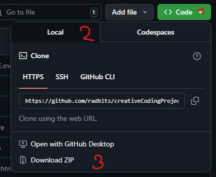
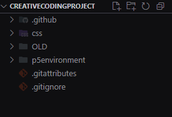

# Creative Coding

Dieses Repository enthält alle Projekte, die ich im Rahmen eines Creative Coding-Kurses erstellt habe. Jedes Projekt experimentiert mit verschiedenen Konzepten und wurde mit **p5.js** umgesetzt.

## Inhaltsverzeichnis

1. [Tools]()
2. [Lokale Installation](#2-lokale-installation)\
   2.1 [Repo herunterladen und extrahieren](#21-github-repo-heruterladen-und-extrahieren)\
   2.2a [In VSCode öffnen](#22a-projekt-in-vscode-öffnen)\
   2.2b [Im Dateiexplorer öffnen](#22b-projekt-im-dateiexplorer-öffnen)
3. [Autor](#5-autor)

## 1 Tools

### Webtechnologien
- HTML: Struktur der Webseiten
- CSS: Gestaltung und Layout
- JavaScript: Interaktivität und Funktionalität

### Bibliotheken
- p5.js: Visuelle Programmierung und kreative Codierung (z. B. Animation, generative Kunst)

### Entwicklungsumgebung
- VSCode (***v1.98.2***):
- Live Server Extension (***v5.7.9***)
- p5.vscode (***v1.2.16***)

## 2 Lokale Installation

**Was du brauchst:**

- Browser mit Zugriff auf das Internet

**Optional, aber empfohlen:**

- VSCode
- Live Server extension für VSCode von Ritwick Dey

> [!NOTE]
> **Für die Funktionalität einiger Projekte wird der Live Server benötigt, daher wird empfohlen, mit VSCode zu arbeiten.**

## 2.1 [Repository](https://github.com/radblts/creativeCodingProject) heruterladen und extrahieren

1. Oben rechts auf `Code` drücken
2. Tab `Local`selektieren
3. `Download ZIP` auswählen

4. Speicherort öffnen z.B. `Downloads`
5. ZIP-Datei mit Rechtsclick auswählen
6. `Extract All` auswählen

> [!NOTE]
>Das Projekt kann nun in VSCode ([Schritt 2a](#32a-projekt-in-vscode-öffnen)) oder direkt über den Dateiexplorer ([Schritt 2b](#32b-projekt-im-dateiexplorer-öffnen)) geöffnet werden. 

## 2.2a Projekt in VSCode öffnen

1. VSCode öffnen
2. Den extrahierten Projektordner per **Drag-and-Drop** in das Programm ziehen

> [!NOTE]
> Alternativ: `File → Open Folder → [Pfad zum Projektordner]`.

In VSCode sollte nun die Projektstruktur im Seitenmenü sichtbar sein:

3. Die Datei `index.html`, im Pfad `p5environment/html`, öffnen

4. Unten rechts auf `Go Live` klicken (Live Server starten)

Nun sollte das Projekt in einem Browser (z.B. `Microsoft Edge`, `Firefox` oder `Chrome`) geöffnet sein.

## 2.2b Projekt im Dateiexplorer öffnen

1. Der extrahierte Ordner öffnen
2. Das `index.html`-File öffnen (Im Pfad `[creativeCodingProject-main/p5environment/html]`)

Nun sollte das Projekt in einem Browser (z.B. `Microsoft Edge`, `Firefox` oder `Chrome`) geöffnet sein.

## 3. Autor

**Neva Roten**

- GitHub: [radblts](https://github.com/radblts)
- E-Mail: neva.roten@edu.vs.ch
